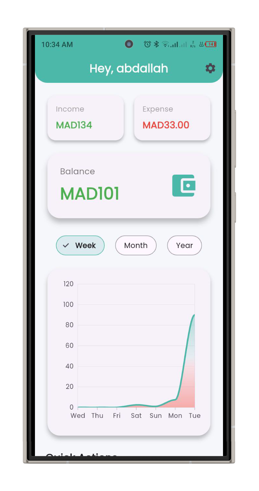
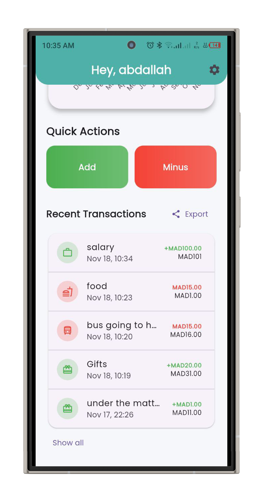
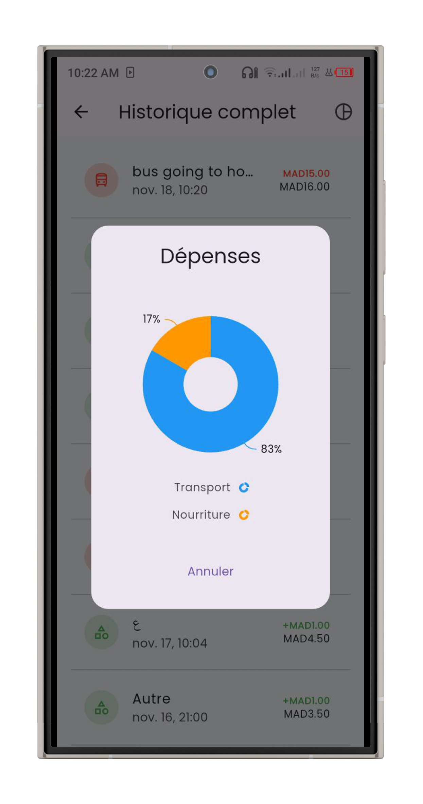
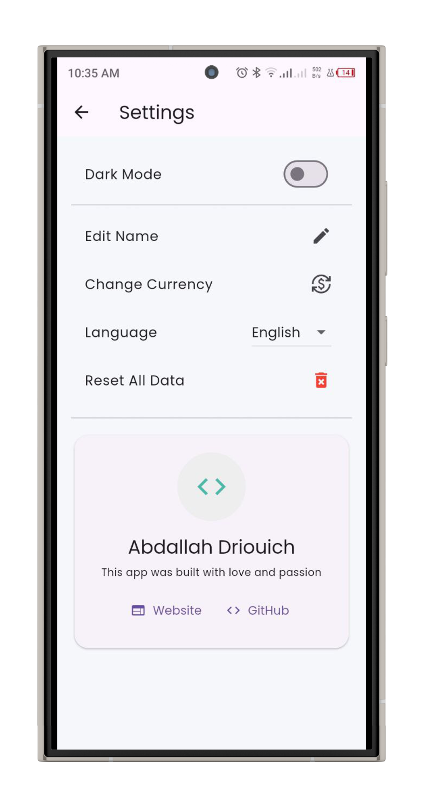
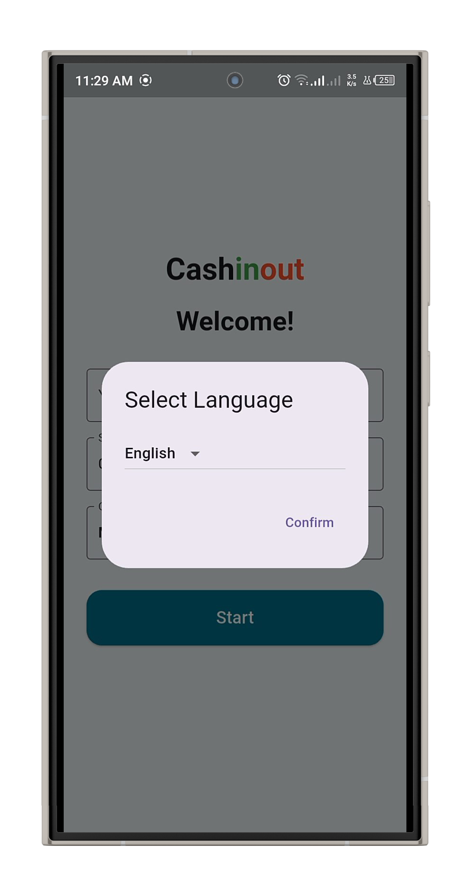

# 💰 Cash-In-Out  
### Track Your Finances Effortlessly


## 💡 About Cash-In-Out
Cash-In-Out is a simple, elegant, and powerful cross-platform application that helps you track your income and expenses with ease. Instead of dealing with complicated spreadsheets, this app gives you a clean and focused way to monitor your cash flow at any moment.

Built with **Flutter**, the app runs smoothly on **Android, iOS, Windows, macOS, Linux, and Web**, delivering a consistent and polished experience everywhere.

---

## ✨ Key Features

### Core Features
- **Quick Transaction Logging**  
  Add income or expenses instantly with a lightweight, intuitive form.

- **Category Management**  
  Use built-in categories or create custom ones to organize your finances.

- **Real-Time Summary Dashboard**  
  Instantly view your total income, total expenses, and net balance.

- **Transaction History**  
  Browse, filter, and search through all past entries.

- **Cross-Platform Support**  
  Same smooth experience on mobile, desktop, and web.

### Additional Features
- **Dark & Light Themes**  
  Adapts automatically to your system theme.

- **Local Storage Persistence**  
  Saves your data locally for instant loading.

- **Offline-First Design**  
  Works fully offline.

- **Export & Backup (Planned)**  
  CSV export + cloud backup support coming soon.

---

## 📱 Screenshots & Demo

### 🎥 Video Demo
Watch the full demo on Vimeo:
👉 [
  // This is the image of the video player
  
]
  // This is the link to the actual video URL
(https://vimeo.com/1138052827)

### Local Video Link
[Demo Video](Mockups/video.mp4)

### 🖼️ Interface Gallery
Images inside the `Mockups/` folder:

<div align="center">
  
  
  
  
  
</div>

---
## ⚙️ Getting Started

### 📥 Quick Download (Android APK)
Download the latest build:

```
cashinout.apk
```

You may need to enable “Install from unknown sources” on Android.

---

## 🧑‍💻 Build From Source

### Prerequisites
- Flutter SDK  
- Dart SDK (included with Flutter)

Check your system:
```sh
flutter doctor
```

### Install the Project
```sh
git clone https://github.com/dev0lcyber/cash-in-out.git
cd cash-in-out
flutter pub get
```

### Run the App
```sh
flutter run
```

For web:
```sh
flutter run -d web
```

---

## 🛠️ Built With
- **Flutter** – UI toolkit for high-quality apps  
- **Dart** – Optimized language for UI development  

---

## 👤 Developer
**Abdallah Driouich**  
Portfolio: https://abdallah.driouich.site

---

## 🤝 Contributing
1. Fork the repository  
2. Create a feature branch:
   ```sh
   git checkout -b feature/NewFeature
   ```
3. Commit:
   ```sh
   git commit -m "Add NewFeature"
   ```
4. Push:
   ```sh
   git push origin feature/NewFeature
   ```
5. Open a Pull Request

---

## 📝 License
Licensed under the **MIT License**.  
See `LICENSE` for details.


